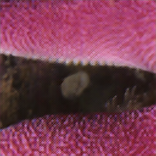
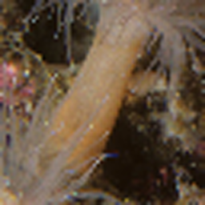
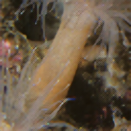
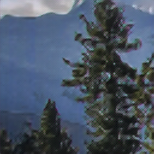
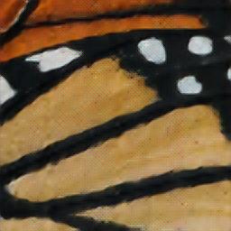
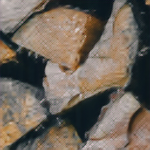
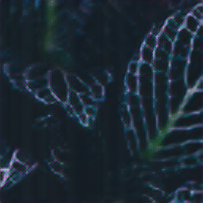

# ImageSuperresolutionCrossAttention
 


Official Pytorch implementation of the "CAESRGAN: Cross Attention Super Resolution GAN With Pyramid Hierarchical Feature Maps"

**Abstract.**
</br>
*Generative Adversarial Networks (GANs) have revolutionized the field of image super-resolution, with models such as SRGAN ([Ledig et al., 2017](https://arxiv.org/abs/1609.04802)), ESRGAN ([Wang et al., 2018](https://arxiv.org/abs/1809.00219)), and Real-ESRGAN ([Wang et al., 2021](https://arxiv.org/abs/2107.10833)) substantially enhancing image quality from low-resolution inputs. Traditional super-resolution architectures employ non-pyramid hierarchical structures that, while maintaining the original image's dimensions, result in higher computational costs, making these networks less suited for integration with computationally intensive methods like TEM ([Wu et al., 2019](https://doi.org/10.1107/S1600576719003665)), FPN ([Lin et al., 2017](https://arxiv.org/abs/1612.03144)), and self-attention ([Vaswani et al., 2023](https://arxiv.org/abs/1706.03762)). To address these challenges, **our study introduces a cross-attention mechanism within a pyramid-hierarchical convolutional structure**, enabling effective semantic information transfer from low to higher resolution layers. This innovative approach significantly reduces the number of layers needed, maintaining competitive performance and achieving a Peak Signal-to-Noise Ratio (PSNR) of 19.3 on the DIV2k dataset ([Timofte et al., 2017](https://openaccess.thecvf.com/content_cvpr_2017_workshops/w12/html/Timofte_NTIRE_2017_Challenge_CVPR_2017_paper.html)), with only 5 layers compared to the traditional 23-layer model.*

**Note**: The provided scripts train on cv2 BGR format 
## Inference results example

Each pair shows a Low-Resolution (LR) image next to its corresponding High-Resolution (HR) version generated by the model.


| Low-Resolution | High-Resolution | Low-Resolution | High-Resolution |
|:--------------:|:---------------:|:--------------:|:---------------:|
|  |  |  |  |


| Low-Resolution | High-Resolution | Low-Resolution | High-Resolution |
|:--------------:|:---------------:|:--------------:|:---------------:|
|  |  |  |  |

| Low-Resolution | High-Resolution | Low-Resolution | High-Resolution |
|:--------------:|:---------------:|:--------------:|:---------------:|
|  |  |  |  |


## Installation
Install the required dependencies

On conda with GPU(s): 
```bash 
conda install pytorch==2.2.0 torchvision==0.17.0 torchaudio==2.2.0 pytorch-cuda=11.8 -c pytorch -c nvidia
```

Install the dependencies:
```bash 
pip install -r requirements.txt
```
## Prepare dataset 
High resolution and low resolution image pairs are required for both training and validation. We provide the script to prepare the data (generate low resolution images from high resolution images using cv2 cubical interpolation down-scaling). For example, the following CLI is used for the DIV2k dataset used in our research paper. The data structure contains 
```
DIV2k
|-train/
|-valid/
```
High resolutions groundtruth images are stored in `train/` and `valid` directories as above. 
```bash
python preparedata.py --data dataset/DIV2k --resolution 256 --downfactor 4 --stride 256
```
This command line creates `hr_train.hdf5`, `lr_train.hdf5`, `hr_valid.hdf5`, `lr_valid.hdf5` files. The files are stored in the original provided `dataset/DIV2k` folder.

## Train model 
To train the baseline ESRGAN model
```bash
python trainESRGan.py --data dataset/DIV2k
```
To train our CAESRGAN model
```bash 
python trainCAESRGan.py --data dataset/DIV2k
```

## Inference 
Example inference using the data in hdf5 valid file 
```bash 
python inference.py --hdf5 dataset/DIV2k/lr_valid.hdf5 --weight <weight-path.pth>
```
<!-- ```bash 
python inference.py --hdf5 /Volumes/TanSSDT7/Columbia\ University/computer\ vision\ 2/dataset/DIV2k/lr_valid.hdf5 --weight /Users/tan/Desktop/ImageSuperresolutionCrossAttention/weights/gen_ep4.pth
``` -->

## Test 
Given a checkpoint directory storing the model after all epochs, we can perform testing to see how the saved weights perform in different epoch. The checkpoint directory is automatically generated during training. 
```bash 
python test.py --data dataset/DIV2k --checkpoint <path-to-checkpoint-directory>
```

## References

1. Ledig, C. et al. (2017). "Photo-Realistic Single Image Super-Resolution Using a Generative Adversarial Network." Proceedings of CVPR.
2. Wang, X. et al. (2018). "ESRGAN: Enhanced Super-Resolution Generative Adversarial Networks." ECCV Workshops.
3. Wang, X. et al. (2021). "Real-ESRGAN: Training Real-World Blind Super-Resolution with Pure Synthetic Data." arXiv preprint arXiv:2107.10833.
4. Wu, J. et al. (2019). "Cascaded Enhancement for TEM Images via Generative Adversarial Networks." Journal of Applied Crystallography.
5. Lin, T.-Y., Dollar, P., Girshick, R., He, K., Hariharan, B., & Belongie, S. (2017). "Feature Pyramid Networks for Object Detection." Proceedings of CVPR.
6. Vaswani, A. et al. (2023). "Attention Is All You Need." Proceedings of NeurIPS.
7. Timofte, R., Agustsson, E., Van Gool, L., Yang, M.-H., Zhang, L. (2017). "NTIRE 2017 Challenge on Single Image Super-Resolution: Methods and Results." CVPR Workshops.
